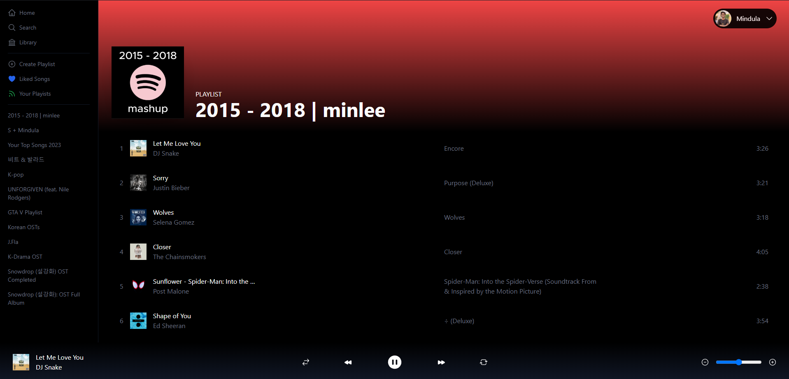
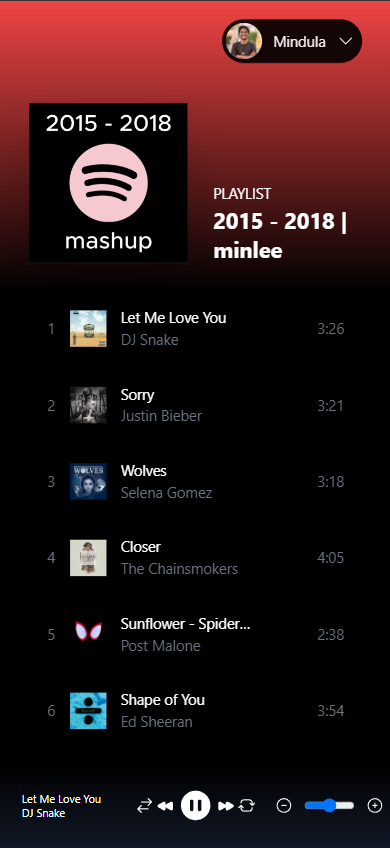
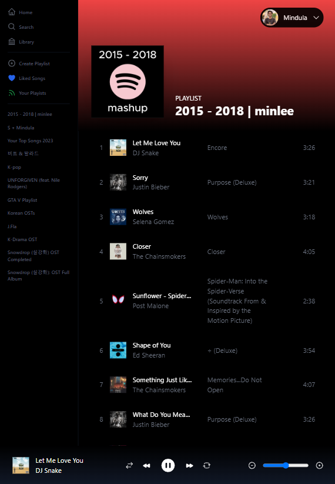

# 🎵 TuneUp

Stream your Spotify playlists from anywhere!

## ✨ Getting Started

1. Clone this project
2. Run `npm i` in the terminal to install all dependencies for your project.
3. Create a `.env.local` file in the project directory.
4. Add `NEXTAUTH_URL` as `http://localhost:3000`.
5. Add `NEXT_PUBLIC_CLIENT_ID` as your Spotify API Client ID.
6. Add `NEXT_PUBLIC_CLIENT_SECRET` as your Spotify API Client Secret.
7. Add any kind of key to `JWT_SECRET`.
8. Finally, run `npm run dev` in your terminal to start the server.

## ⚙️ Tech Stack

1. React
2. Next.js 14
3. Next Auth
4. Spotify API
5. Recoil
6. Tailwind

## 📸 Screenshots

### 💻 Desktop

### 📱 Mobile

<b>Mobile</b>

<b>Tablet</b>

## 🙏 Special Thanks

**This project was completed with the help of [Spotify Clone by Sonny Sangha](https://youtu.be/3xrko3GpYoU).**
